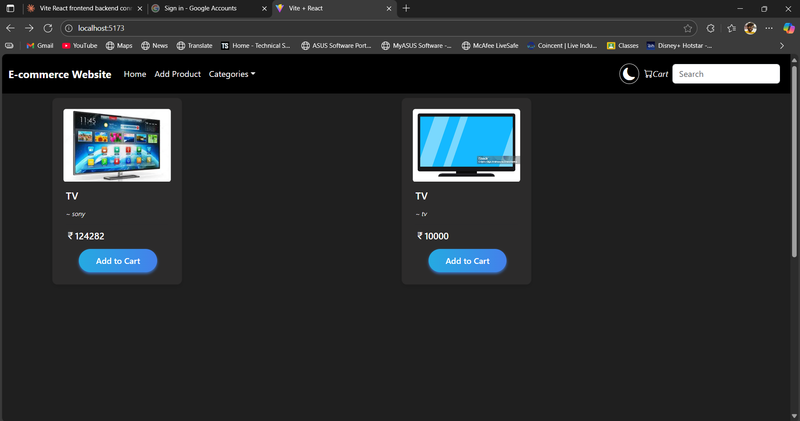
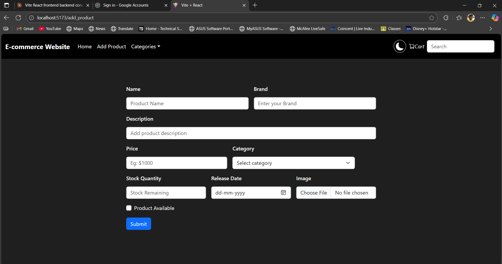
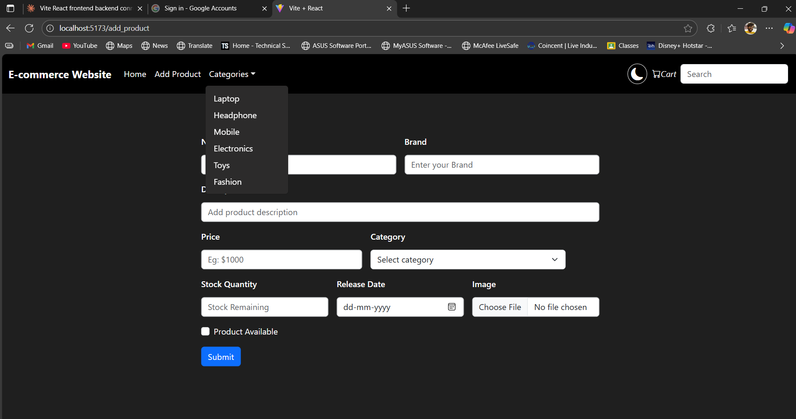
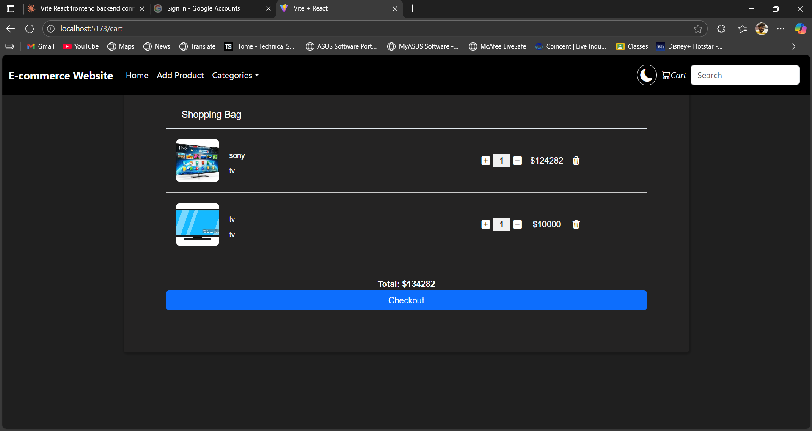
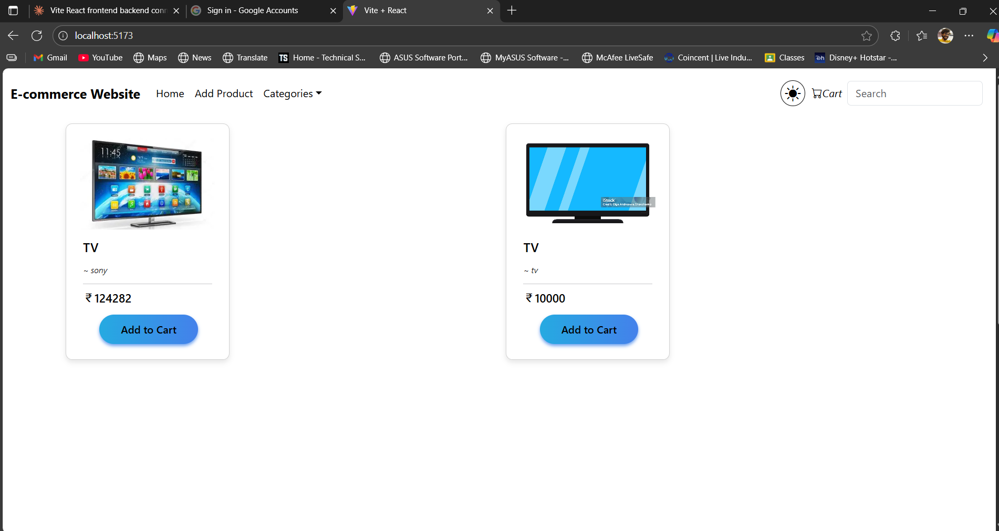

# 🛒 Full-Stack E-Commerce Website  

A **full-stack e-commerce application** built with **Spring Boot (backend)** and **React + Vite (frontend)**.  
Features include **user authentication, product management, categories, cart, and checkout system**.  

---

## ✨ Features  
- ✅ User login with JWT authentication  
- ✅ Add, edit, and delete products  
- ✅ Category-based product browsing  
- ✅ Shopping cart & checkout  
- ✅ Responsive frontend built with React + TailwindCSS  
- ✅ REST API backend with Spring Boot  

---

## 🖼️ Screenshots  

### 🏠 Home Page  
  

### ➕ Add Product  
  

### 📂 Categories Dropdown  
  

### 🛒 Shopping Cart  
  

### 🌙 Dark / ☀️ Light Mode  
  

---

## 🛠️ Tech Stack  

**Frontend**  
- React (Vite)  
- TailwindCSS  
- Axios  

**Backend**  
- Spring Boot  
- Spring Security (JWT Auth)  
- Hibernate / JPA  
- MySQL / PostgreSQL  

---

## ⚙️ Installation  

### 🔹 Backend Setup  
```bash
cd ecom-backend
mvn spring-boot:run
Backend runs on: http://localhost:8080

Configure application.properties:

properties
Copy code
spring.datasource.url=jdbc:mysql://localhost:3306/ecomdb
spring.datasource.username=root
spring.datasource.password=yourpassword

jwt.secret=your-secure-secret
jwt.expiration-ms=86400000
🔹 Frontend Setup
bash
Copy code
cd ecom-frontend
npm install
npm run dev
Frontend runs on: http://localhost:5173

📂 Project Structure
bash
Copy code
E-commerce-Project/
 ├── ecom-backend/    # Spring Boot Backend
 ├── ecom-frontend/   # React + Vite Frontend
 ├── screenshots/     # UI screenshots
 └── README.md
👨‍💻 Developer
Sai Jaswanth Potagani
📍 Hyderabad
📧 potaganijaswanth203@gmail.com
🔗 LinkedIn | GitHub

yaml
Copy code
